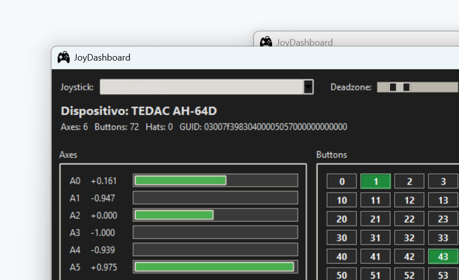
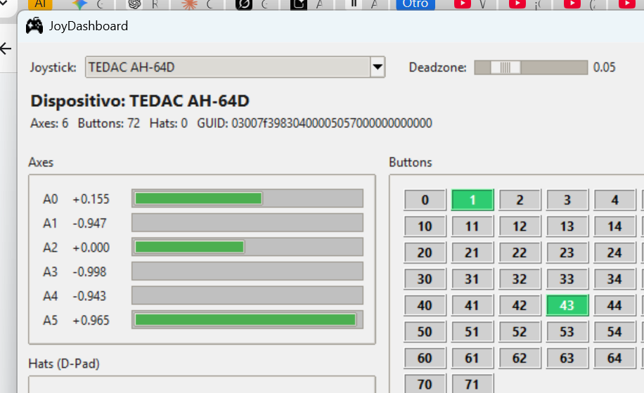

# JoyDashboard

A lightweight joystick/gamepad tester built with Python, Tkinter and Pygame. Supports devices with 80+ buttons, multiple axes, and D-Pad (hat) inputs.

## Features

- Real-time axis readout with progress bars
- Button grid (up to 80+) with press highlight
- Hat / D-Pad display
- Adjustable deadzone slider
- Multi-device selector (hotswap)
- **Dark / Light theme toggle**
- Embedded gamepad icon — no external files needed

## Screenshots

### Dark Mode


### Light Mode


## Requirements

```
pygame
```

Install with:

```bash
pip install pygame
```

## Run from source

```bash
python testg.py
```

## Build standalone executable

```bash
pip install pyinstaller pillow
python -m PyInstaller --onefile --windowed --icon=icon.ico --name=joydashboard testg.py
```

The executable will be at `dist/joydashboard.exe`.

## License

Icon: [CC0 – uxwing.com](https://uxwing.com/game-controller-icon/)
Code: MIT
